## 1. 登陆

&emsp;&emsp;学生端登陆网址：<a href="http://labgrader.hitsz.edu.cn:8000/" target="_blank">labgrader.hitsz.edu.cn:8000</a>。推荐使用Chrome浏览器，初始用户名/密码均为学号。

&emsp;&emsp;初始登陆之后建议修改自己的密码，步骤见本页的5.修改密码。

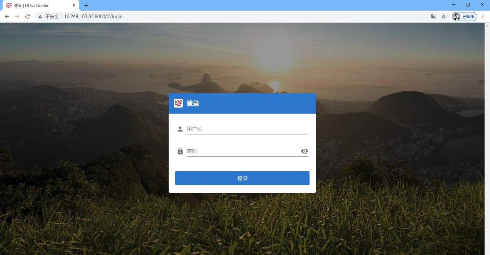

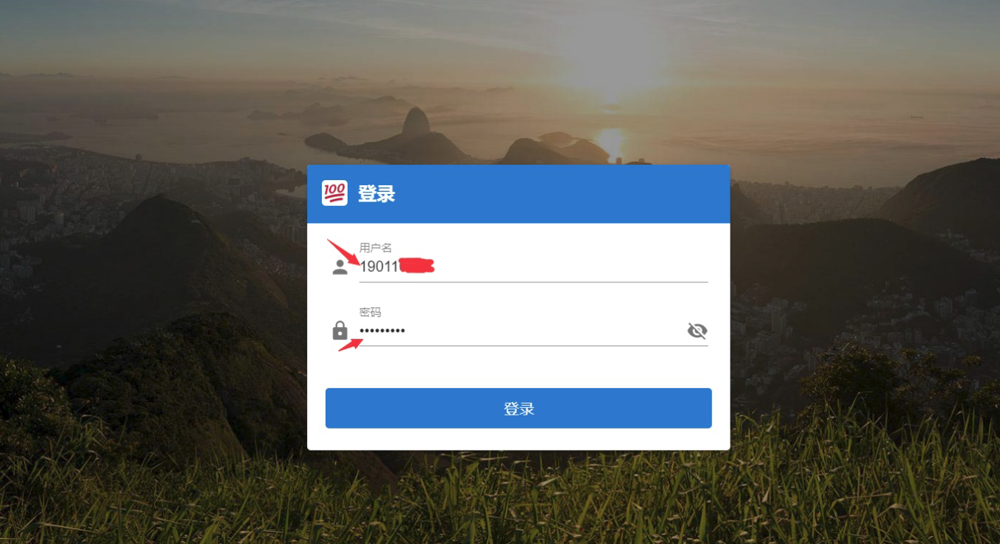

## 2. 查看课程

&emsp;&emsp;登录之后即可查看自己所选的课程。

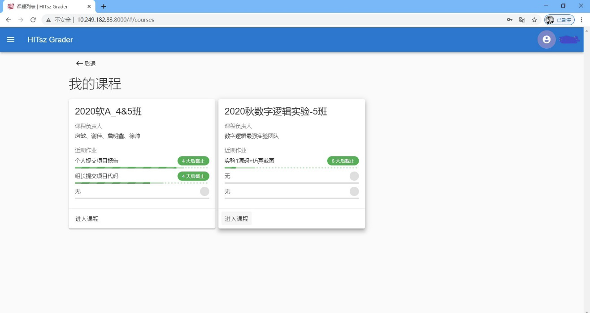

&emsp;&emsp;点击进入课程即可查看课程详细内容。

&emsp;&emsp;特别注意作业提交的 **截止时间**！

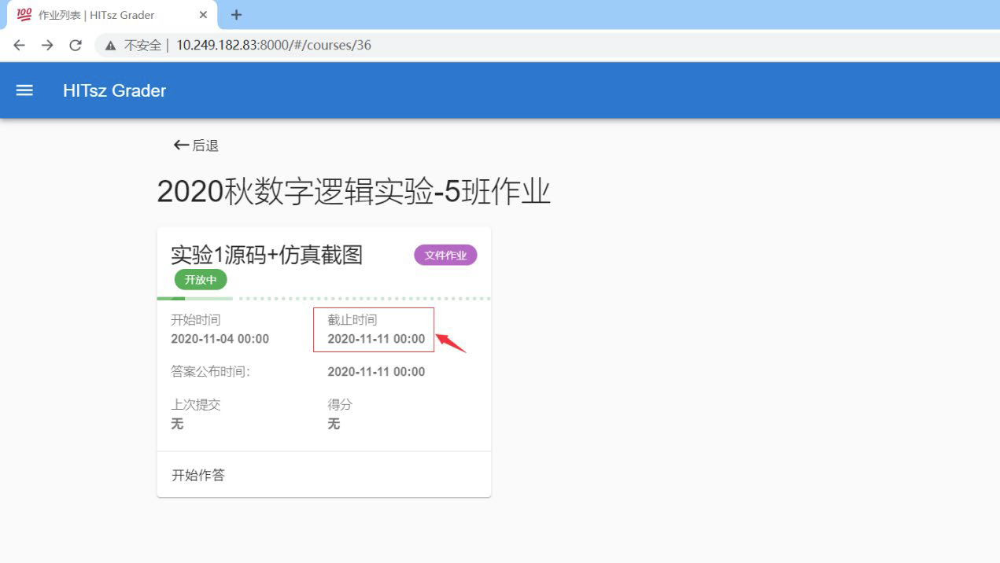

## 3. 提交作业

&emsp;&emsp;点击 **开始作答** 进行作业作答或提交。

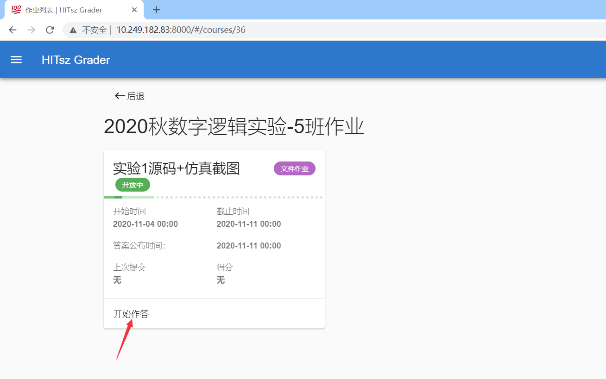

&emsp;&emsp;开始作答页面：

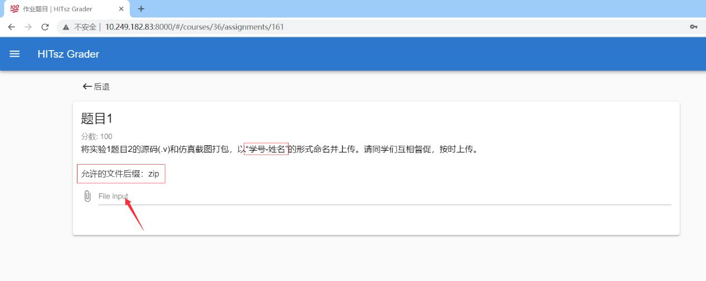

&emsp;&emsp;点击File input选择需要提交的文件进行作业提交

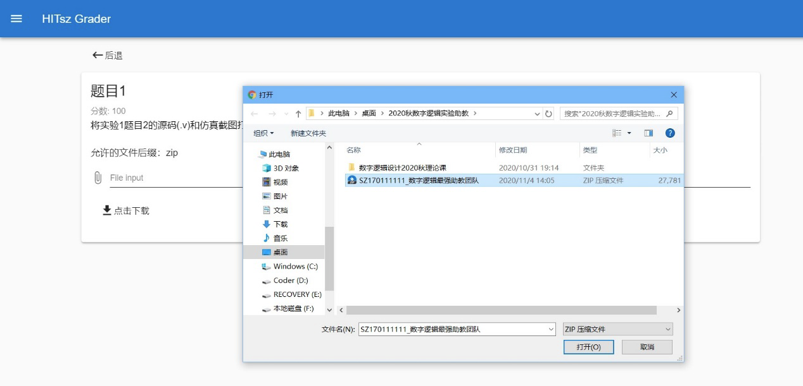

&emsp;&emsp;选择完成后，点击页面右下角提交按钮完成提交

&emsp;&emsp;**看到页面跳转后，表示已提交成功。中途关闭浏览器将导致提交失败！**

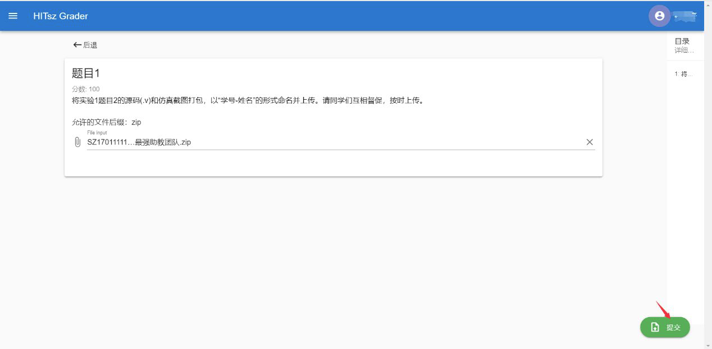

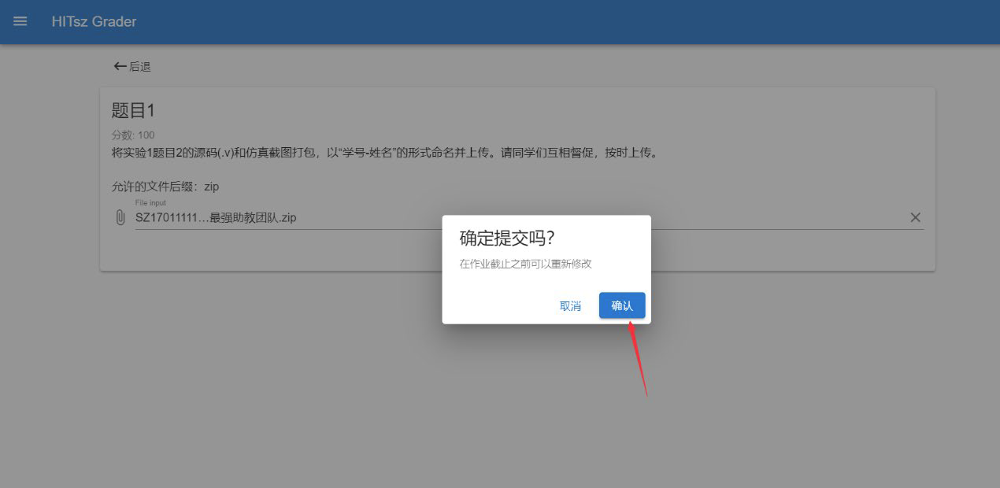

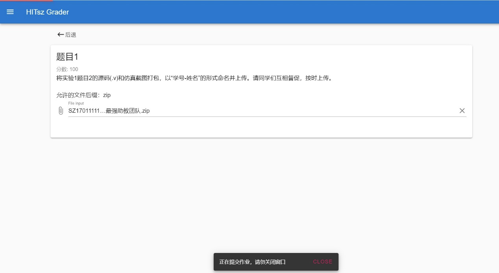

## 4. 重新提交作业

&emsp;&emsp;提交作业后，截止时间前仍可重新提交作业。

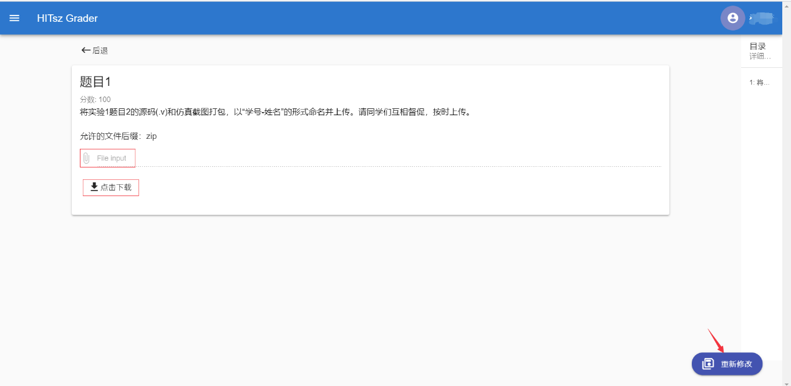

## 5. 修改密码

&emsp;&emsp;点击右上角账号信息即可进入密码修改

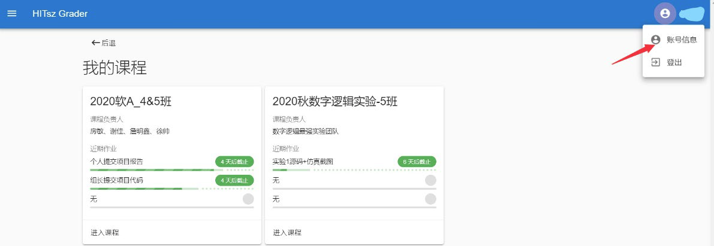

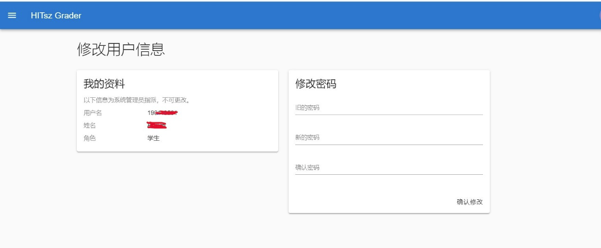

## 6. 注意事项

&emsp;&emsp;（1）截止时间前可重新提交作业，目前不限提交次数；

&emsp;&emsp;（2）请注意提交截止时间，截止时间后无法提交作业；

&emsp;&emsp;（3）注意提交作业时文件压缩包后缀目前仅支持.zip；

&emsp;&emsp;（4）目前不支持提交大于100MB的文件。
