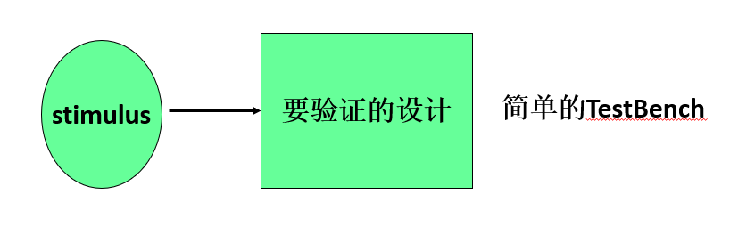
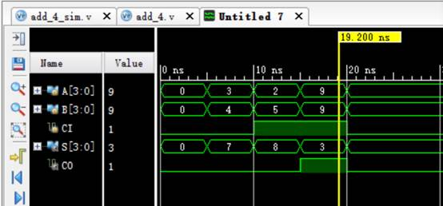

# 模块测试

- 测试平台（Test Bench）是一个无输入，有输出的顶层调用模块。
- 一个简单的测试平台包括：
  - 产生激励信号；
  - 实例化待测模块，并将激励信号加入到待测模块中。



- 激励模块通常是顶层模块
- 激励信号数据类型要求为`reg`，以便保持激励值不变，直至执行到下一跳激励语句为止
- 输出信号的数据类型要求为`wire`，以便能随时跟踪激励信号的变化

- Testbench框架：

```Verilog
 1|`timescale  1ns/1ns                 // 时间单位为1ns，精度为1ns
 2|module module_name_sim();           // 模块名（无端口声明列表）
 3|    
 4|    // 输入到待验证模块的激励信号
 5|    reg  [7:0] in1;
 6|    reg  [3:0] in2;
 7|    ......
 8|
 9|    // 对接待验证模块的输出信号
10|    wire [7:0] out1;
11|    wire       out2;
12|    ......
13|    
14|    module_name instance_name (     // 实例化待验证模块
15|        .port1_i    (in1),
16|        .port2_i    (in2),
17|        ......
18|        .port1_o    (out1),
19|        .port2_o    (out2),
20|        ......
21|    );
22|    
23|    initial begin                   // 提供激励信号
24|    	   in1 = 8'h12;
25|        in2 = 4'hF;
26|        
27|        #5  // 5ns后执行下面的语句
28|        in1 = 8'h34;
29|        in2 = 4'hE;
30|        ......	
31|    end	
32|endmodule
```

!!! example "代码实例 :chestnut:"
    - 四位全加器模块测试（接上例）

    ```Verilog
     1|`timescale 1ns / 1ps 
     2|module add_4_sim();
     3|    reg [3:0] A, B;
     4|    reg CI;
     5|    wire [3:0] S;
     6|    wire CO;
     7|    
     8|    adder_4 DUT (A, B, CI, S, CO);
     9|    
    10|    initial begin
    11|        A = 4'd0; B = 4'd0; CI = 1'b0;
    12|        #5 A = 4'd3; B = 4'd4; CI = 1'B0;
    13|        #5 A = 4'd2; B = 4'd5; CI = 1'b1;
    14|        #5 A = 4'd9; B = 4'd9; CI = 1'b1;
    15|        #5 A = 4'd0; B = 4'd0; CI = 1'b0;
    16|    end
    17|    
    18|endmodule
    ```

    - 仿真波形：
  
    