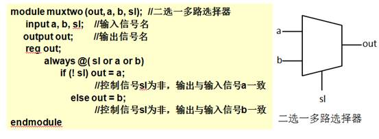
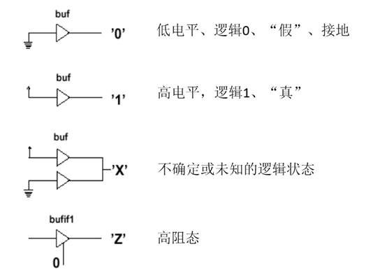
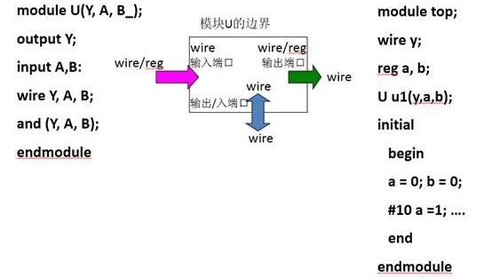

# 标识符和数据类型

## 标识符

- 赋给对象的唯一名称，可以是字母、数字、下划线和符号“`$`”的组合，且首字符只能是字母或者下划线。

- 大小写敏感。

- 关键词用小写字母定义，如：`always`，`and`，`assign`等。

- 注释有两种：
  - 以“`/*`”开头，以“`*/`”结束。
  - 以“`//`”开头到本行结束。

## 数据类型

- 共19种数据类型，分为物理数据类型和抽象数据类型。

- **物理数据类型**
    - 包括线网型（`wire`）、寄存器型（`reg`）、存储器型（`memory`）等。
    - 抽象程度较低，与实际硬件电路的对应关系较强。

- **抽象数据类型**
    - 包括参数型（`parameter`和`localparam`）、整型（`integer`）、时间型（`time`）、实型（`real`）等。
    - 抽象程度较高，与实际硬件电路的对应关系较弱。
    - 抽象数据类型是用于进行辅助设计和验证的数据类型。


- 数据类型还可分为常量和变量
    - 常量：数字、参数型（`parameter`和`localparam`）
    - 变量：连线型（`wire`）、寄存器型（`reg`）、存储器型（`memory`）等

---

### 线网类型（`wire`）

- 硬件电路中元件之间实际连线的抽象，如器件的管脚，内部器件如与非门的输出等。

- 不存储逻辑值，必须有持续的驱动。通常由`assign`赋值，如`assign Y = ~(A & C)`。

- `wire`型的信号无驱动时，缺省值为 <font color=blue>Z</font>（高阻）。

- 信号未定义数据类型时，缺省为`wire`类型。

- 实例：

<center></center>

### 寄存器类型（`reg`）

- `reg`型的变量具有状态保存的作用。综合后常常是寄存器或触发器，<u>但不一定总是这样</u>。

- 在过程块“`always`”块内被赋值的每一个信号都必须定义成`reg`型。

- `reg`型的变量只能在`initial`或`always`过程语句的内部被赋值。

- 没有赋值情况下默认为 <font color=red>X</font>（不定值）。

- `reg`型和`wire`型的区别：
    - `reg`型保持最后一次赋值
    - `wire`型需要持续的驱动

### 参数型（`parameter`和`localparam`）

- 格式：`parameter <参数名> = <数字或表达式>;`

    - 参数定义完以后，程序中出现的所有的参数名都将被替换为相对应的表达式。
    
- 参数属于常量，常用来定义延迟时间、变量的位宽等。

- 实例：

```verilog
 1|    // 定义了两个参数
 2|    parameter LENGTH = 32,
 3|              WEIGHT = 16;
 4|
 5|    // 局部参数
 6|    localparam THRESHOLD = 7;
```

- `parameter`型和`localparam`型的区别：
    - `parameter`型：在模块或实例引用时，可通过参数传递改变在被引用模块或实例中已定义的参数。
    - `localparam`型：只能在被定义的模块中访问，不可在模块或实例引用时通过传参的形式改变。

### 数字

- 编码形式：二进制（b或B）、十进制（d或D）、十六进制（h或H）、八进制（o或O）

- 表达方式：
    - `<位宽>'<进制><数字>`，这是一种全面的描述方式
    - 也可使用`'<进制><数字>`描述，此时采用默认位宽（由具体的机器系统决定，但至少32位）
    - 在`<数字>`这种描述方式中，默认十进制
    - 例：
        - `8’b10101100`表示位宽为8、用二进制表示、值为172的数字。
        - `8’hA2`表示位宽为8、用十六进制表示、值为162的数字。

- 负数：在位宽表达式前加一个减号，减号必须写在数字定义表达式的最前面。
    - 例：`-8’d5`表示-5的补码，且位宽为8

### 四种逻辑值

- Verilog HDL是四值系统，包含`0`、`1`、`X`、`Z`四种取值，如下图所示。

<center></center>

### 如何选择正确的数据类型？

- 输入端口（`input`）：可以由寄存器或线网连接驱动，但它本身只能驱动线网连接。

- 输出端口（`output`）：可以由寄存器或线网连接驱动，但它本身只能驱动线网连接。

- 输入/输出端口（`inout`）：只可以由线网连接驱动，但它本身只能驱动线网连接。

- 如果信号变量是在过程块中被赋值的（如`initial`块或`always`块），必须把它声明为寄存器类型变量。

<center></center>
