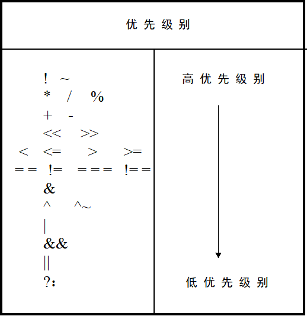

# 运算符及表达式

## 运算符

按功能分为以下几类：

| 种类 | 运算符 |
| :-: | :-: |
| 算术运算符 | `+`&emsp;`-`&emsp;`*`&emsp;`/`&emsp;`%` |
| 逻辑运算符 | `&&`&emsp;`||`&emsp;`!` |
| 位运算符 | `~`&emsp;`|`&emsp;`^`&emsp;`&`&emsp;`^~` |
| 赋值运算符 | `=`&emsp;`<=` |
| 关系运算符 | `>`&emsp;`<`&emsp;`>=`&emsp;`<=` |
| 条件运算符 | `?:` |
| 移位运算符 | `<<`&emsp;`>>`&emsp;`>>>` |
| 拼接运算符 | `{}` |
| 等式运算符 | `==`&emsp;`!=`&emsp;`===`&emsp;`!==` |
| 其他 | 略 |

### 算术运算符

- 在进行整数的除法运算时，结果要略去小数部分，只取整数部分。

- 在进行取模运算时（亦称求余运算），结果的符号位与模运算符第一个操作数的符号相同。

- 在进行算术运算时，如果某一个操作数有不确定的值`X`，则整个结果也为不确定值`X`。

### 逻辑运算符

- `&&`和`||`是双目运算符，其优先级别低于关系运算符，而`!`高于算术运算符。

### 位运算符

- 在不同长度的数据进行位运算时，系统会自动的将两个数右端对齐，位数少的操作数会在相应的高位补0，然后将两个操作数按位进行操作。

### 关系运算符

- 如果关系运算的表达式为真，则返回值是1；否则返回值是0。 

- 关系运算符的优先级别低于算数运算符，如`a < size - 1`等同于`a < (size - 1)`。

- 如果某个操作数值不定，则关系是模糊的，返回值是不定值`X`。

### 移位运算符

- 表达式`a >> n`中，`a`是将要进行移位的数据，`n`是移位的位数。

- `<<`和`>>`是逻辑移位操作符，都用0来填补移出的空位。`>>>`是算术右移操作符，使用符号位来填补移出的空位。

- 如果操作数已经定义了位宽，则移位后操作数值发生改变，但其位宽不变。

### 拼接运算符

- `{`信号1的某几位`, `信号2的某几位`, `...`, `信号n的某几位`}`将某些信号的某些为列出来，中间用逗号分开，最后用大括号括起来表示一个整体的信号。

- 在位拼接的表达式中不允许存在没有指明位数的信号。

### 等式运算符

- `==`，`!=`：`X`和`Z`进行比较时，结果为`X`。

&emsp;&emsp;`==`的真值表如下：

| ==  | 0   | 1 | X | Z |
| :-: | :-: | :-: | :-: | :-: |
| 0   | 1 | 0   | X | X  |
| 1 | 0   | 1 | X | X  |
| X | X | X | X | X |
| Z | X | X | X | X |

- `===`，`!==`：操作数相同结果为1，常用于case表达式的判别。

&emsp;&emsp;`===`的真值表如下：

| === | 0   | 1 | X | Z |
| :-: | :-: | :-: | :-: | :-: |
| 0   | 1 | 0   | 0   | 0   |
| 1 | 0   | 1 | 0   | 0   |
| X | 0   | 0   | 1 | 0   |
| Z | 0   | 0   | 0   | 1 |

### 运算符优先级别表

