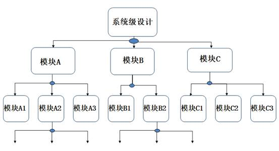

# 模块的调用

- 无论多么复杂的系统，总能划分成多个小的功能模块。系统的设计可以按照下面三个步骤进行：
  - （1）把系统划分成模块；
  - （2）规划各模块的接口；
  - （3）对模块编程并连接各模块完成系统设计。
- 模块是分层的。各模块连接完成整个系统需要一个顶层模块（top-module）。

- 高层模块通过调用、连接低层模块的实例来实现复杂的功能，即模块实例化。




## 模块实例化方法

- 调用模块实例的一般形式为：
    - <模块名><参数列表><实例名>(<端口列表>);
    - `module_name instance_name(port_associations);`

- 其中参数列表是传递到子模块的参数值。

- 信号端口可以通过位置或名称关联，但是关联方式不能够混合使用。

- 定义模块：`module Design(port1, port2, port3, ......);`
    - 引用时，严格按照模块定义的端口顺序来连接，不用标明原模块定义时规定的端口名。
        - `Design u_1(u1_port1, u1_port2, ......);    // 和Design对应`
    - 引用时，用”.”符号，标明原模块定义时规定的端口名。
        - `Design u_2(.(port1(u1_port1), .(port2(u1_port2), ......);`

!!! example "代码实例 :chestnut:"
    ```Verilog
    1|module and1 (
    2|  input  wire A,
    3|  input  wire B,
    4|  output reg  C
    5|);
    6|
    7|    ......
    8|
    9|endmodule
    ```

    - 实例化时采用接口信号的位置/顺序来关联：`and1 A1 (T3,A,B);`

    - 实例化时采用接口信号名字来关联：`and1 A2 (.C(T3), .A(A), .B(B))；`

- `port_expr`可以是以下的任何类型：
    - 标识符（`reg`或`net`）如`.C(T3)`，`T3`为`wire`型标识符。
    - 位选择，如 `.C(D[0])`，`C`端口接到`D`信号的第`0`位。
    - 部分选择，如` .Bus(Din[5:4])`。
    - 上述类型的合并，如`.addr({A1，A2[1:0]})`。
    - 表达式（只适用于输入端口），如`.A(wire Zire = 0)`。

- 例化名不能为元模块名或关键字。
