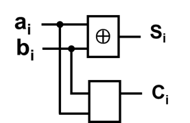
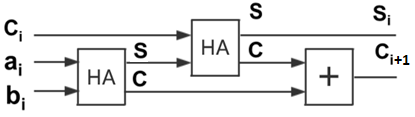

# 4位全加器设计实例


- 半加器模块：半加器由两个一位输入相加，输出一个结果位和进位。
- 1位全加器模块：由两个半加器和一个或门实现。
- 4位全加器模块：由4个1位全加器串联形成。

## 半加器



```Verilog
 1|module half_adder (      //半加器
 2|     input  wire a_i,
 3|     input  wire b_i,
 4|     output wire sum_o,
 5|     output wire carry_o
 6|);
 7|
 8|    assign sum_o   = a_i ^ b_i;
 9|    assign carry_o = a_i & b_i;
10|
11|endmodule
```
## 1位全加器



```Verilog
 1|module full_adder (
 2|     input  wire a_i,
 3|     input  wire b_i,
 4|     input  wire carry_i,
 5|     output wire sum_o,
 6|     output wire carry_o
 7|);
 8|
 9|    wire sum1;                                        
10|    wire c1, c2;
11|
12|    half_adder half_adder1 (
13|        .a_i      (a_i),
14|        .b_i      (b_i),
15|        .sum_o    (sum1),
16|        .carry_o  (c1)
17|    );    
18|     
19|    half_adder half_adder2 (
20|        .a_i      (carry_i),
21|        .b_i      (sum1),
22|        .sum_o    (sum_o),
23|        .carry_o  (c2)
24|    );
25|     
26|    assign carry_o = c1 | c2;
27|
28|endmodule
```


## 4位全加器

```Verilog
 1|module adder_4 (     // 4位全加器
 2|    input  wire [3:0] a_i,
 3|    input  wire [3:0] b_i,
 4|    input  wire       carry_i,
 5|    output wire [3:0] sum_o,
 6|    output wire       carry_o
 7|);
 8|
 9|    wire [3:0] c_tmp; 
10|    full_adder i0 (a_i[0], b_i[0], carry_i,  sum_o[0], c_tmp[0]); 
11|    full_adder i1 (a_i[1], b_i[1], c_tmp[0], sum_o[1], c_tmp[1]); 
12|    full_adder i2 (a_i[2], b_i[2], c_tmp[1], sum_o[2], c_tmp[2]); 
13|    full_adder i3 (a_i[3], b_i[3], c_tmp[2], sum_o[3], c_tmp[3]); 
14|    assign carry_o = c_tmp[3];
15|
16|endmodule
```

